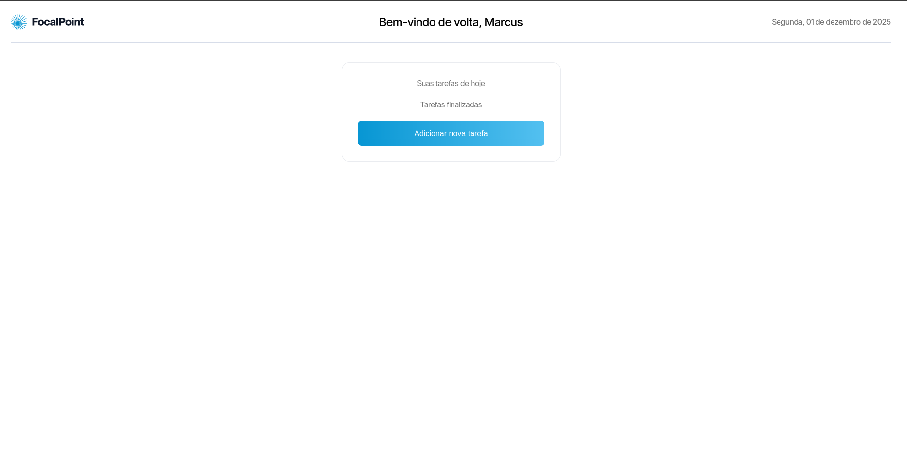
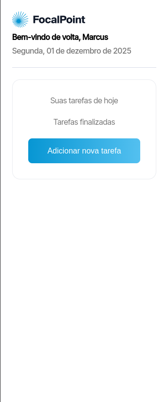

<div align="center">


</div>

<div align="right">

#### - Projeto finalizado 🟢

</div>
<div align="center">

# Focalpoint | Todo list

</div>


### <div align="center"> Aplicação em Nextjs/Typescript, abordando conceitos sobre: </div>

- [TypeScript](https://www.typescriptlang.org/) - Tipagens
- [Nextjs](https://nextjs.org/) - Framework frontend
- [Sass](https://sass-lang.com/) - Estilização usando modelo BEM e mobile first

## <div align="center">Requisitos</div>

Para executar a aplicação é necessário instalar algumas ferramentas tais como um editor de códigos para realizar compilação dos mesmos. Nesse projeto foi utilizado o [Visual Studio Code](https://code.visualstudio.com/), [NodeJS](https://nodejs.org/en/) para compilação do código, [git](https://git-scm.com/downloads) para baixar o repositório e baixar todas as dependências necessárias.

```bash
# Clone este repositório(caso ja tenha feito isso no passo anterior, pule para o próximo comando)
$ git clone <https://github.com/Ricnaga/focalpoint-todo>

# Acesse a pasta do projeto no terminal
$ cd focalpoint-todo

# Instale as dependências
$ npm install
$ yarn
$ pnpm install

# Inicie a aplicação
$ yarn dev (ou npm run dev)
$ npm run dev
$ pnpm dev
```

#
